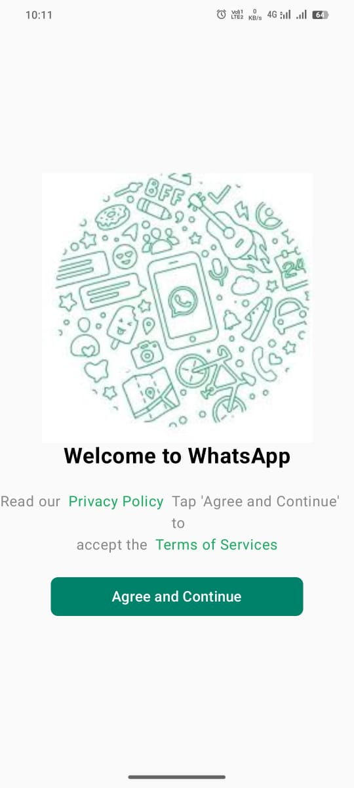
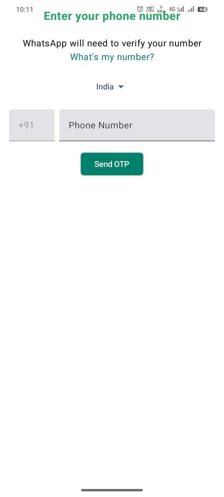
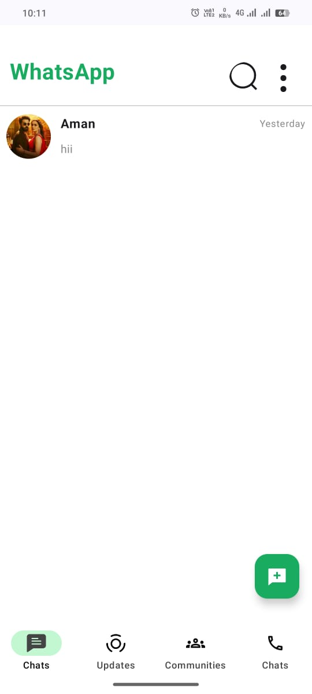
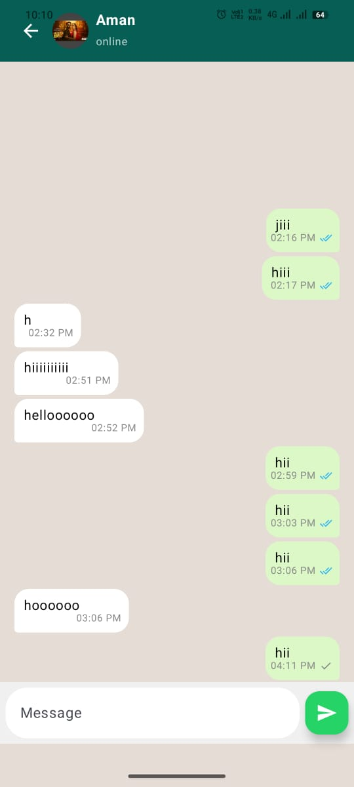
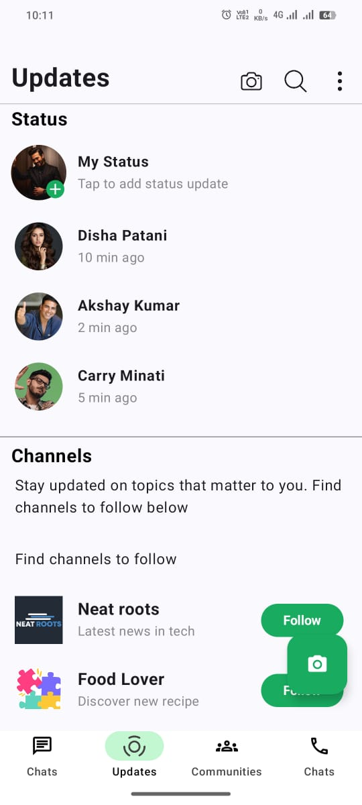
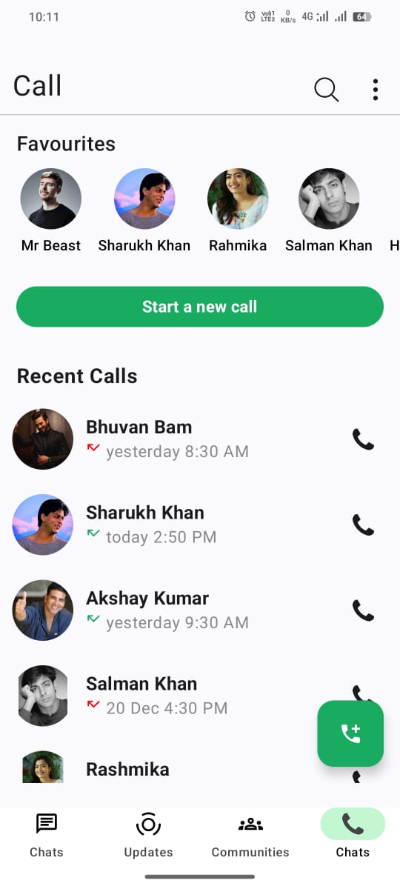

# 📱 WhatsApp Clone – Android Application

A **WhatsApp Clone Android app** built using **Kotlin, Jetpack Compose, and Firebase** to understand real-time messaging, authentication, and modern Android app architecture.

This project replicates core WhatsApp features such as one-to-one chat, user authentication, and a clean chat UI.

---

## 🚀 Features
- 🔐 User Authentication (Login & Signup)
- 💬 One-to-One Real-Time Chat
- 🏠 Chat Home Screen
- 🖼️ Status Screen UI
- 📞 Call Screen UI
- ⚡ Firebase Realtime Database
- 🎨 Modern UI with Jetpack Compose

---

## 🛠️ Tech Stack
- **Kotlin**
- **Jetpack Compose**
- **Firebase Authentication**
- **Firebase Realtime Database**
- **MVVM Architecture**
- **Coroutines**

---

## 📷 Screenshots

### 🚀 Splash Screen

### 🔐 Login Screen

### 🏠 Home Screen

### 💬 Chat Screen

### 🟢 Status Screen

### 📞 Call Screen

---

## 🎯 Purpose of the Project
This project was created to:
- Learn **real-time chat implementation**
- Practice **Firebase integration**
- Build UI using **Jetpack Compose**
- Understand **clean app architecture**

---

## 📌 Learning Outcomes
- Real-time data handling with Firebase
- State management in Jetpack Compose
- MVVM-based Android project structure
- Authentication & chat logic implementation

---

## 🔮 Future Improvements
- Group Chats
- Media Sharing (Images & Videos)
- Push Notifications
- Message Read Receipts
- Dark Mode

---

## 👨‍💻 Developer
**Shoaib Akhtar**  
Aspiring Android & Software Developer 🚀
